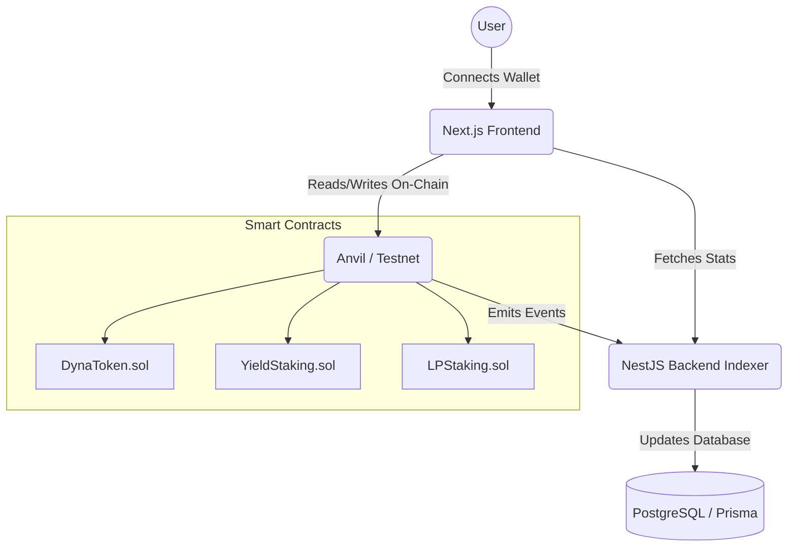

# DYNA Protocol


DYNA is a decentralized staking and liquidity protocol. The application showcases an end-to-end integration of Smart Contracts, a caching Backend, and a modern Web3 Frontend.

## 🏗 Architecture



## 🚀 Quick Start (Local Setup)

This project requires [Node.js](https://nodejs.org/) (v18+) and [Foundry](https://getfoundry.sh/) to be installed.

### 1. Smart Contracts
Start a local Anvil node and deploy the contracts:
```bash
cd contracts
forge install
anvil &
forge script script/Deploy.s.sol --rpc-url http://127.0.0.1:8545 --broadcast
```

### 2. Backend (NestJS Indexer)
Run the backend cache/indexer service:
```bash
cd backend
npm install
npx prisma generate
npm run start:dev
```
*Note: The backend will run on `http://localhost:3000` by default. For the portfolio demo, a mock service indexer is enabled.*

### 3. Frontend (Next.js Dashboard)
Run the web application:
```bash
cd frontend
npm install --legacy-peer-deps
npm run dev
```
Open [http://localhost:3001](http://localhost:3001) in your browser. (Note: use port 3001 or equivalent if 3000 is occupied by NestJS).

## 🛠 Tech Stack
- **Frontend**: Next.js 14+, React, Tailwind CSS v4, Wagmi, Viem, Framer Motion
- **Backend**: NestJS, Prisma ORM, PostgreSQL (configurable via schema)
- **Smart Contracts**: Solidity ^0.8.20, Foundry, OpenZeppelin

## 📸 Portfolio Highlights
- Modern dark futuristic UI with neon green highlights (inspired by Dynamic Labs).
- Gas-optimized staking mechanics fully implemented on-chain using `rewardPerToken` accumulators.
- Clean separation of concerns via Monorepo structure.

---
*Developed as a showcase portfolio project for Senior Web3 Fullstack Engineering roles.*
